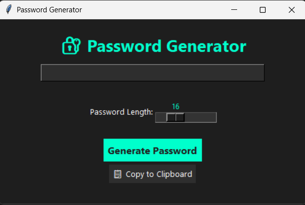

# Password Generator

A simple and stylish **Password Generator** desktop app built with Python and Tkinter.

---

## Features

- Generates strong, random passwords including letters, digits, and special characters.
- Adjustable password length (8 to 40 characters) via an intuitive slider.
- Copy generated password to clipboard with a single click.
- Modern dark-themed GUI for comfortable use.
- Easy to extend and customize.

---

## Screenshot

<p align="center">
  
</p>

*This shows the UI of the password generator app.*

---

## Installation

1. Make sure you have Python 3 installed.  
2. Clone this repository:
   ```bash
   git clone https://github.com/yourusername/password-generator.git
3. Navigate to the project folder:
   ```bash
   cd Password_Generator
4. Run the app:
   ```bash
   python Main.py

## Usage
- Move the slider to select the desired password length.
- Click Generate Password to create a new password.
- Click Copy to Clipboard to copy the generated password for easy pasting.

## Technologies Used
- Python 3.x
- Tkinter (built-in Python GUI library)
- string and random modules for password generation